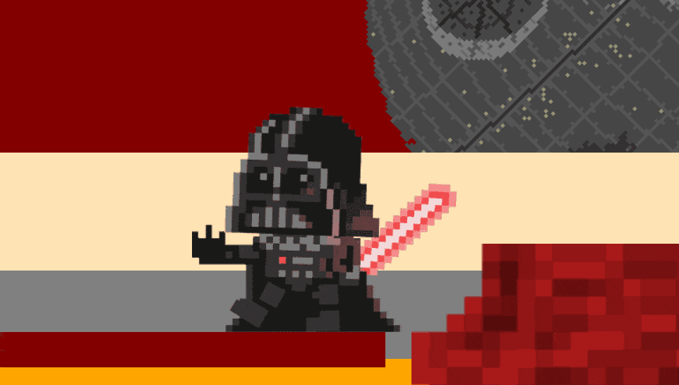
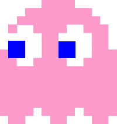
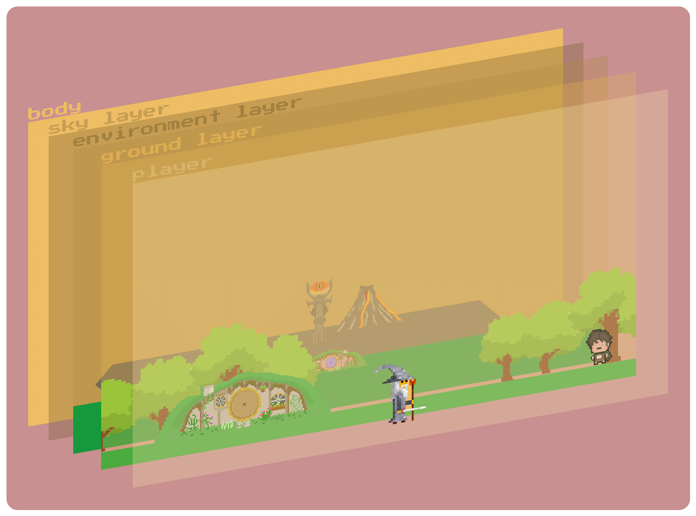
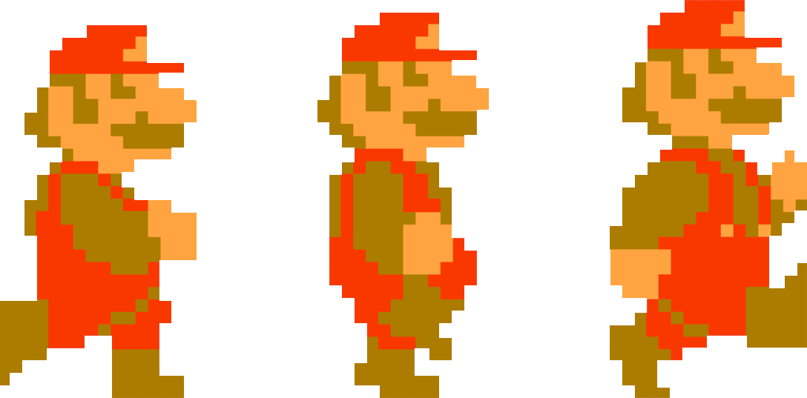

<sub>*React-world is being sponsored by the following tool; please help to support us by taking a look and signing up to a free trial*</sub>
<a href="https://tracking.gitads.io/?repo=react-world">
  </a>

---


## Few layers, scroll event manipulations and of course famous movie and game characters. [ Live Demo](https://sfatihk.github.io/react-world/#)



---

This document aims to explain how **React World** works.

There are 4 topics: **withScroll**, **SceneObject**, **MainLayer** and **Player**

## withScroll

- Scroll event handling and computing processes takes place within this component.
- And re-adjust page height for scroll manipulation. (or fake scroll page)
- **withScroll** is [High Order Component(HOC)](https://tr.reactjs.org/docs/higher-order-components.html) and provides onScrolling, scroll and scrollDirection datas to **wrapped component**. Also it covered whole **App**.

---

usage :

```js
import withScroll from "./withScroll";

class wrappedComp ...{
    ...

    const {scroll,onScrolling,scrollDirection} = this.props

    ...
}

export default withScroll(wrappedComp);
```

---

withScroll props :

| attribute       | type    | return                |
| --------------- | ------- | --------------------- |
| onScrolling     | boolean | true/false            |
| scroll          | float   | between [0-maxScroll] |
| scrollDirection | integer | 0(right), 1(left)     |

## SceneObject



- I created a standard for inter-component compatibility. Then i called it SceneObject, like GameObject in Unity Game Engine.
- Every components are derived from the SceneObject.
- You can set component position, scale and rotation easily.

---

usage :

```js
import SceneObject from "./SceneObject";

const Enemy = props => {
  return (
    <SceneObject
      name="Enemy"
      transform={{
        position: props.transform.position, //or {x:100,y:"50%"}
        scale: { x: 200, y: 203 }, //or {x:"100%,y:"100%"}
        rotation: 180,
        opacity: 1
      }}
      bgRepeat={false}
      color={"none"}
      imgUrl={enemyPicture}
      animation={props.canAnimate ? animateNow : ""}
    />
  );
};

export default Enemy;
```

---

SceneObject options :

| option                 | name                      | format             | default |
| ---------------------- | ------------------------- | ------------------ | ------- |
| **transform**          | position,scale & rotation | object             | none    |
| **transform.position** | left & bottom             | {x : any, y : any} | unset   |
| **transform.scale**    | width & height            | {x : any, y : any} | unset   |
| **transform.rotation** | transform: rotate()       | numeric            | 0       |
| **opacity**            | opacity                   | numeric [0-1]      | unset   |
| **color**              | background-color          | html color         | none    |
| **imgUrl**             | background                | numeric            | none    |
| **bgRepeat**           | background-repeat         | boolean            | false   |
| **animation**          | animation                 | css animation      | none    |

## Main Layers



- There are 3 main layers. Sky,Environment and Ground.
- Scenes are defined in the main layers, so if main layer move whole scene will move.
- Every main layer has a **animations** structure, like movement instructions.
- The behavior related to scroll movement is defined in this structure.
- **Animations**, includes start-finish scroll ranges and start-finish layer position.
- **Animation Calculation** function calculates every scroll movement steps and returns the new position.

---

example of animation structure :

```js
//...
this.animations = {
      //it will swipe ground layer -10000px on x axis at 0-5050 scroll range
      //wont move on y axis
      "0-5050": { position: { x: [0, -10000], y: [0, 0] } },

      //it will swipe ground layer -10000px to -15000 on x axis and
      //it will swipe ground layer 700px on x yxis at at 5050-7050 scroll range and,
      "5050-7050": { position: { x: [-10000, -15000], y: [0, 700] } },
    };
  }

  //will calculate when scroll change
  shouldComponentUpdate(nextProps, nextState) {
    if (this.props.scroll !== nextProps.scroll) {
      this.transform = AnimateCalculation(this.animations, nextProps.scroll);
      return true;
    }

    return false;
  }
```

## Player



- Player is actually a main layer. But didn't move x or y axis.
- Player includes 2 animations: hero/skin changing and jumping, and they defined in **animation** structure.

---

animations example in for jump

```js
const animations = {
  //vader jumps
  "8000-8650": { startHeight: 200, endHeight: 100, type: "fall" },
  "8700-9320": { startHeight: 100, endHeight: 200, type: "jump" },
  "9370-9800": { startHeight: 200, endHeight: 100, type: "fall" },
...
}
```

---

animations example in hero/skin changing and walking

```js
const heroes = {
  gandalf: {
    speed: 30,
    delimiter: 10, // speed / step
    frames: [
      [gandalf_01, gandalf_02, gandalf_03],
      [gandalf_11, gandalf_12, gandalf_13]
    ] //left - right
  }
  ...
}
...
const heroesShowUp = {
  "0-7050": { hero: "gandalf" },
  "7050-12100": { hero: "vader" },

```

## I hope you enjoyed it

You can visit to [Thanks List](/THANKS.md)
